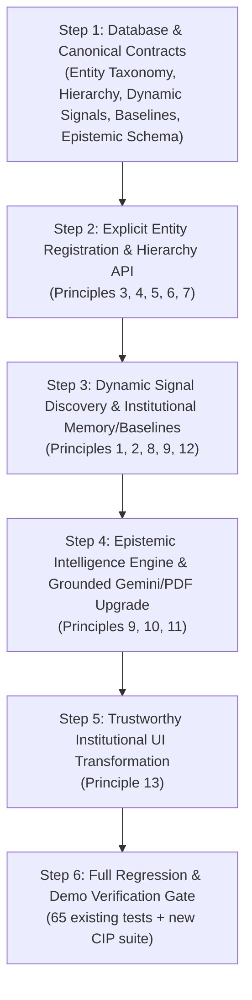

# CIP — Crisis Intelligence Platform: Transformation Implementation Map

**Workspace**: `C:\Users\Dell\.gemini\antigravity\scratch\ai_criss`  
**Audit Date**: September 28, 2026  
**Implementation Window**: September 27–29, 2026  
**Hard Deadline**: September 30, 2026  
**Baseline Status**: `v1.4.0` — **65 / 65 automated tests passing**, live UAT verified (`http://127.0.0.1:8000`)

---

## 1. Current Architecture

The existing repository implements a 5-layer modular monolith (**FastAPI + SQLAlchemy 2.0 Async + Pydantic v2 + Google Gen AI SDK + ReportLab**):

```mermaid
flowchart LR
    subgraph L1["1. Ingestion & Adapters"]
        EX["ExcelInstitutionalAdapter\n(src/adapters/excel_adapter.py)"]
        JS["JSONDictionaryAdapter\n(src/adapters/json_adapter.py)"]
        SYN["SyntheticDataGenerator\n(src/engine/synthetic_generator.py)"]
    end
    subgraph L2["2. Canonical Contracts & ACID Store"]
        CON["Pydantic v2 Schemas\n(src/contracts/*.py)"]
        DB["SQLite + aiosqlite\n(src/db/models.py, repository.py)"]
    end
    subgraph L3["3. Deterministic Intelligence Engine"]
        FEAT["Feature Extractor\n(src/engine/features.py)"]
        ANOM["TemporalAnomalyDetector\n(src/engine/anomaly_detector.py)"]
        CRI["CrisisIntelligenceEngine\n(src/engine/crisis_scorer.py)"]
        PRED["TrajectoryPredictor\n(src/engine/predictor.py)"]
    end
    subgraph L4["4. Evidence & Grounded Synthesis"]
        EVID["EvidenceAssembler\n(src/engine/evidence.py)"]
        LLM["LLMStructuredReasoner\n(src/engine/llm_reasoner.py)"]
        PDF["ReportLab PDF Engine\n(src/reporting/pdf_generator.py)"]
    end
    subgraph L5["5. Presentation & API"]
        API["FastAPI + RBAC JWT\n(src/api/main.py, routes/*)"]
        UI["Static HTML/JS Dashboard\n(src/frontend/static/index.html)"]
        NXT["Next.js App Source\n(src/frontend/src/app/*)"]
    end
    L1 --> L2 --> L3 --> L4 --> L5
```

- **Host Runtime Constraint**: Node.js (`node`/`npm`) is not installed on the local Windows machine; therefore, the FastAPI-served static frontend ([src/frontend/static/index.html](file:///C:/Users/Dell/.gemini/antigravity/scratch/ai_criss/src/frontend/static/index.html) at `/dashboard/`) is the **primary live executable UI**, while [src/frontend/src/app/](file:///C:/Users/Dell/.gemini/antigravity/scratch/ai_criss/src/frontend/src/app) holds synchronized Next.js source templates.

---

## 2. Capability Classification Matrix

Classification taxonomy: `WORKING` | `NEEDS CHANGE` | `PARTIAL` | `BROKEN` | `MISSING` | `TEST-ONLY`

| Capability | Classification | Actual Code & Evidence | Audit Assessment vs. CIP Target Principles |
| :--- | :---: | :--- | :--- |
| **1. Frontend** | **NEEDS CHANGE** | [src/frontend/static/index.html](file:///C:/Users/Dell/.gemini/antigravity/scratch/ai_criss/src/frontend/static/index.html), [src/frontend/src/app/](file:///C:/Users/Dell/.gemini/antigravity/scratch/ai_criss/src/frontend/src/app) | Live browser UI at `/dashboard/` works end-to-end with JWT auth, charts, sliders, and PDF export, **but** is styled/labeled as an "Engineering Cockpit" (`AI CRISS — Institutional Crisis Intelligence Cockpit`) and lacks explicit entity registration, hierarchy views, dynamic signal views, and epistemic separation. |
| **2. Backend / API** | **PARTIAL** | [src/api/main.py](file:///C:/Users/Dell/.gemini/antigravity/scratch/ai_criss/src/api/main.py), [ingest_routes.py](file:///C:/Users/Dell/.gemini/antigravity/scratch/ai_criss/src/api/routes/ingest_routes.py), [evaluate_routes.py](file:///C:/Users/Dell/.gemini/antigravity/scratch/ai_criss/src/api/routes/evaluate_routes.py) | Core evaluation, simulation, report, and ingest routes are `WORKING`. **Missing** explicit entity/organization registration endpoints (`POST /api/v1/entities` or `POST /api/v1/institutions/register`), parent-child hierarchy endpoints, and dynamic signal discovery/baseline endpoints. |
| **3. Database / Models** | **NEEDS CHANGE** | [src/db/models.py](file:///C:/Users/Dell/.gemini/antigravity/scratch/ai_criss/src/db/models.py), [src/db/repository.py](file:///C:/Users/Dell/.gemini/antigravity/scratch/ai_criss/src/db/repository.py), [src/db/session.py](file:///C:/Users/Dell/.gemini/antigravity/scratch/ai_criss/src/db/session.py) | ACID SQLite + `aiosqlite` persistence works with idempotent upserts. However, [`InstitutionModel`](file:///C:/Users/Dell/.gemini/antigravity/scratch/ai_criss/src/db/models.py#L16-L34) only stores `(id, name, state, accreditation_grade)`. Missing `entity_type`, `entity_type_other`, `ownership_governance`, `education_level`, `academic_domain`, `parent_organization_id`, and institutional baseline/memory storage. |
| **4. Authentication** | **WORKING** | [src/api/auth.py](file:///C:/Users/Dell/.gemini/antigravity/scratch/ai_criss/src/api/auth.py), [src/api/routes/auth_routes.py](file:///C:/Users/Dell/.gemini/antigravity/scratch/ai_criss/src/api/routes/auth_routes.py) | PBKDF2-SHA256 password hashing, JWT bearer tokens, and strict RBAC (`SuperAdmin`, `Auditor`, `Analyst`, `Viewer`) are fully validated and must be preserved intact. |
| **5. Ingestion** | **NEEDS CHANGE** | [src/adapters/excel_adapter.py](file:///C:/Users/Dell/.gemini/antigravity/scratch/ai_criss/src/adapters/excel_adapter.py), [src/adapters/json_adapter.py](file:///C:/Users/Dell/.gemini/antigravity/scratch/ai_criss/src/adapters/json_adapter.py), [ingest_routes.py](file:///C:/Users/Dell/.gemini/antigravity/scratch/ai_criss/src/api/routes/ingest_routes.py) | Currently auto-creates the institution on upload (`InstitutionRepository.upsert` in [`ingest_routes.py`](file:///C:/Users/Dell/.gemini/antigravity/scratch/ai_criss/src/api/routes/ingest_routes.py#L91-L92)) violating Principle 3, and only extracts 3 hardcoded signal types rather than dynamically discovering signals from arbitrary workbooks/JSON payloads (Principle 8). |
| **6. Canonical Schema** | **NEEDS CHANGE** | [src/contracts/base.py](file:///C:/Users/Dell/.gemini/antigravity/scratch/ai_criss/src/contracts/base.py), [admissions.py](file:///C:/Users/Dell/.gemini/antigravity/scratch/ai_criss/src/contracts/admissions.py), [placements.py](file:///C:/Users/Dell/.gemini/antigravity/scratch/ai_criss/src/contracts/placements.py), [cet_ranking.py](file:///C:/Users/Dell/.gemini/antigravity/scratch/ai_criss/src/contracts/cet_ranking.py) | Hardcoded around technical college `AdmissionsSignal`, `PlacementsSignal`, and `CETRankingSignal`. Needs additive `EntityRegistrationContract` (Principles 3–7), `DynamicInstitutionalSignal` & `DataQualityProfile` (Principles 8–9), and `EpistemicIntelligenceContract` (Principle 10) while keeping existing 3 signal models for backward compatibility. |
| **7. Intelligence Engine** | **PARTIAL** | [src/engine/features.py](file:///C:/Users/Dell/.gemini/antigravity/scratch/ai_criss/src/engine/features.py), [src/engine/crisis_scorer.py](file:///C:/Users/Dell/.gemini/antigravity/scratch/ai_criss/src/engine/crisis_scorer.py) | Deterministic feature extraction and multi-department intake-weighted CRI rollup are `WORKING` for the 3 core academic signals, but need additive support for dynamically discovered signals (financial, governance, research, compliance, staffing, etc.) and institution-specific baselines (Principles 1, 8, 12). |
| **8. Anomalies / Risk** | **PARTIAL** | [src/engine/anomaly_detector.py](file:///C:/Users/Dell/.gemini/antigravity/scratch/ai_criss/src/engine/anomaly_detector.py), [src/engine/crisis_scorer.py](file:///C:/Users/Dell/.gemini/antigravity/scratch/ai_criss/src/engine/crisis_scorer.py) | Z-score + domain-threshold + cross-signal divergence detection is `WORKING` and validated. Needs generic temporal Z-score/drift anomaly detection over any dynamically discovered numeric signal series against institution-specific baselines. |
| **9. Prediction** | **WORKING** | [src/engine/predictor.py](file:///C:/Users/Dell/.gemini/antigravity/scratch/ai_criss/src/engine/predictor.py) | Autoregressive trajectory forecasting (`STATUS_QUO` vs `WITH_INTERVENTION`) with confidence bands (`±0.08/yr`) is `WORKING`. Can be extended additively to accept generic signal drift slopes alongside legacy slopes. |
| **10. Evidence** | **NEEDS CHANGE** | [src/engine/evidence.py](file:///C:/Users/Dell/.gemini/antigravity/scratch/ai_criss/src/engine/evidence.py) | `EvidenceToken` and `InstitutionalDossier` are `WORKING`, but `signal_coverage` is hardcoded to `{"admissions", "placements", "cet_ranking"}` ([`evidence.py`](file:///C:/Users/Dell/.gemini/antigravity/scratch/ai_criss/src/engine/evidence.py#L68-L72)) and lacks explicit epistemic partitioning into **Facts**, **Analysis**, **Inference**, **Prediction**, and **Unknowns / Uncertainty** plus **Data Quality / Completeness** metrics (Principles 9–10). |
| **11. Gemini Integration** | **PARTIAL** | [src/engine/llm_reasoner.py](file:///C:/Users/Dell/.gemini/antigravity/scratch/ai_criss/src/engine/llm_reasoner.py) | Official `google-genai` SDK integration at `temperature=0.0` with Pydantic schema enforcement, invariant protection, and deterministic offline fallback is `WORKING` (Principle 11). Needs prompt/schema enrichment so Gemini explicitly synthesizes grounded explanations separated by epistemic layer without conflating facts, inferences, and unknowns. |
| **12. PDF / Reporting** | **PARTIAL** | [src/reporting/pdf_generator.py](file:///C:/Users/Dell/.gemini/antigravity/scratch/ai_criss/src/reporting/pdf_generator.py) | ReportLab Platypus binary PDF generator (`%PDF-1.4`) is `WORKING`. Needs additive sections to display the entity's full institutional classification/hierarchy, dynamic signal coverage, data quality/uncertainty metrics, and the 5-part epistemic breakdown. |
| **13. Tests** | **WORKING** | `tests/test_*.py` (12 test files, 65 tests) | **65 / 65 automated tests passing** across unit, database, API, security, LLM safeguards, PDF stream decompression, and 10 E2E scenarios. Must be 100% preserved. |
| **14. Seeded / Test Data** | **PARTIAL** | [src/engine/synthetic_generator.py](file:///C:/Users/Dell/.gemini/antigravity/scratch/ai_criss/src/engine/synthetic_generator.py) | 12 synthetic scenarios work deterministically, but all assume a single technical college archetype. Needs multi-entity demo seed support (e.g., a parent Educational Group/Trust containing diverse child entities, plus public/research bodies). |
| **15. RYMEC Support** | **NEEDS CHANGE** | [src/adapters/excel_adapter.py](file:///C:/Users/Dell/.gemini/antigravity/scratch/ai_criss/src/adapters/excel_adapter.py), [index.html](file:///C:/Users/Dell/.gemini/antigravity/scratch/ai_criss/src/frontend/static/index.html#L76) | Parsing `project data set.xlsx` (`RYMEC`, `CRI = 0.573 HIGH`) works and must be preserved, **but** UI/adapter currently treat RYMEC as the default/hardcoded product identity (`Upload .xlsx (RYMEC)`). Must be reframed so RYMEC is one registered institution/dataset inside CIP (Principle 2). |
| **16. Existing Skills / Dependencies** | **WORKING** | [requirements.txt](file:///C:/Users/Dell/.gemini/antigravity/scratch/ai_criss/requirements.txt), `<skills>` | Python `.venv` has `fastapi`, `sqlalchemy`, `aiosqlite`, `openpyxl`, `google-genai`, `reportlab`, `pytest`. Relevant agent skills identified in Section 5. |
| **17. Current UI** | **NEEDS CHANGE** | [src/frontend/static/index.html](file:///C:/Users/Dell/.gemini/antigravity/scratch/ai_criss/src/frontend/static/index.html) | Currently a neon-dark "Crisis Cockpit" (`#0b0f19` with pulsing red light and "Simulate Crisis" controls). Must be redesigned into **trustworthy institutional intelligence software** (Principle 13) with explicit entity registration, organization tree, dynamic signal discovery table, and epistemic tabs (Facts / Analysis / Inference / Prediction / Unknowns). |
| **18. Explicit Entity Classification & Multi-Institution Hierarchy** | **MISSING** | N/A | Principles 3, 4, 5, 6, 7 are not yet implemented in the schema, API, or UI. |
| **19. Institutional Memory & Institution-Specific Baselines** | **MISSING** | N/A | Principle 12: Currently baselines are computed on-the-fly from `[:-1]` slices in `anomaly_detector.py` or fixed constants (`45,000` rank in `excel_adapter.py`). Needs persistent institution-specific baselines and longitudinal assessment memory. |

---

## 3. Validated Capabilities That MUST Be Preserved

To guarantee zero regressions across the 65 passing tests and existing workflows, the following validated components must remain backward-compatible:

1. **All Existing Pydantic Contracts & Imports (`src/contracts/__init__.py`)**:
   - `ProvenanceMetadata`, `CanonicalSignalBase`, `CETRankingSignal`, `AdmissionsSignal`, `PlacementsSignal`, `CrisisAssessment`, `SignalAnomaly` must retain all existing field names and validators; new CIP fields must have safe defaults (`Optional[...]` or `Field(default=...)`).
2. **Deterministic Mathematical Invariants (`src/engine/*`)**:
   - `extract_department_features`, `extract_institutional_features` (sorted department determinism).
   - `TemporalAnomalyDetector` (prior-window Z-score + domain threshold fallback + cross-signal intake-up/placement-down divergence).
   - `CrisisIntelligenceEngine.evaluate_institution` (CRI bounds `[0.0, 1.0]`, risk thresholds `0.70/0.50/0.30`, multi-department intake-weighted rollup).
   - `TrajectoryPredictor` (`predict_trajectory`, `simulate_intervention`, confidence bands `±0.08 * year_offset`).
3. **LLM Safeguards & Grounding (`src/engine/llm_reasoner.py`)**:
   - `LLMStructuredReasoner.generate_narrative(dossier)` must continue enforcing `temperature=0.0`, Pydantic `response_schema`, mathematical invariant overrides (`institution_id`, `composite_risk_index`, `risk_level` copied from `dossier`), and zero-downtime deterministic fallback when `GEMINI_API_KEY` is unset or fails.
4. **Binary PDF Generation (`src/reporting/pdf_generator.py`)**:
   - `generate_crisis_pdf(dossier, narrative, trajectory)` must continue returning valid `%PDF-1.4` bytes with decompressible text streams containing institution ID, CRI, risk level, and evidence tokens.
5. **Authentication & RBAC Security (`src/api/auth.py`, `src/api/routes/auth_routes.py`)**:
   - `/api/v1/auth/register`, `/api/v1/auth/login`, `/api/v1/auth/me`, role validation (`SuperAdmin`, `Auditor`, `Analyst`, `Viewer`), and 10 MB upload cap (`413`).
6. **Legacy API Route Signatures (`/api/v1/ingest/*`, `/api/v1/institutions/*`)**:
   - Existing test payloads in `tests/test_api.py`, `tests/test_e2e_scenarios.py`, `tests/test_security.py`, and `tests/test_reporting.py` must continue to pass without modification, while new CIP registration and dynamic intelligence capabilities are exposed via backward-compatible extensions and dedicated endpoints.
7. **RYMEC Dataset Compatibility (`src/adapters/excel_adapter.py`)**:
   - Uploading `C:\Users\Dell\OneDrive\Documents\antigravity\project data set.xlsx` must continue to parse all 30 multi-department signals (`RYMEC`, `CRI = 0.573`, `HIGH`).

---

## 4. Gap Analysis Against the 13 Target Product Principles

| # | Target Product Principle | Current Gap | Exact Architectural Remediation |
| :---: | :--- | :--- | :--- |
| **1** | **CIP is a broad institutional intelligence platform, not a placement/admission dashboard.** | Branding (`AI CRISS`), weights (`DEFAULT_TECHNICAL_COLLEGE`), and UI focus exclusively on engineering college admissions/placements/CET ranks. | Rebrand UI/reports to **CIP — Crisis Intelligence Platform**; support multi-domain signal categories (`academic`, `admissions`, `placements`, `financial`, `governance`, `research`, `compliance`, `staffing`, `infrastructure`, `custom`). |
| **2** | **RYMEC is only one institution/dataset, never the product schema.** | `ExcelInstitutionalAdapter` is tailored to RYMEC sheet layouts and UI button says `Upload .xlsx (RYMEC)`. | Generalize `ExcelInstitutionalAdapter` to pair standard tabular/sheet discovery with the preserved RYMEC parser; change UI to generic Institutional Data Ingestion where RYMEC is simply one selectable/uploadable institution. |
| **3** | **Users must explicitly classify what they are registering; CIP must not infer the top-level entity.** | `ingest_routes.py` silently auto-creates institutions via `InstitutionRepository.upsert` during file upload. | Add explicit entity registration workflow (`POST /api/v1/institutions/register` & UI Registration Modal/Form) requiring explicit user classification. Keep auto-upsert only as a legacy fallback flag (`allow_unregistered_fallback=True` for existing automated tests, while the UI and strict CIP mode require explicit registration first). |
| **4** | **Entity classification must support: `institution`, `university`, `educational group/network`, `government/public body`, `private organization`, `nonprofit/trust/society`, `research/academic body`, and extensible `"Other"`.** | `InstitutionModel` has no `entity_type` column. | Add `EntityType` enum/literal and `entity_type` column to `InstitutionModel` and `InstitutionRegistrationRequest` supporting all 8 required classifications. |
| **5** | **`"Other"` must always allow a user-defined text value.** | Missing. | Add `entity_type_other: Optional[str]` to DB model, Pydantic validator (requiring non-empty `entity_type_other` when `entity_type == "other"`), and conditional text input in the registration UI. |
| **6** | **Ownership/governance, entity type, education level, academic domain, and parent organization are separate concepts.** | Only `state` and `accreditation_grade` exist on `InstitutionModel`. | Add distinct, orthogonal fields on `InstitutionModel`: `entity_type`, `entity_type_other`, `ownership_governance` (e.g., Public/Government, Private Aided, Private Unaided, Autonomous, Trust/Society, Corporate, Other), `education_level` (e.g., Undergraduate, Postgraduate, Doctoral, K-12, Vocational, Multi-Level, N/A), `academic_domain` (e.g., Engineering & Technology, Medical & Health, Multidisciplinary, Public Policy, Research, General, Other), and `parent_organization_id`. |
| **7** | **Organizations may contain multiple institutions of different types.** | Flat table with no parent-child relationship. | Add self-referential/hierarchical `parent_organization_id` (`ForeignKey("institutions.id")`) on `InstitutionModel` + endpoint `GET /api/v1/institutions/{id}/children` and portfolio rollup view so a parent organization (e.g., an `educational_group_network` or `nonprofit_trust_society`) can contain multiple child institutions of different types (`university`, `institution`, `research_academic_body`). |
| **8** | **CIP must discover signals dynamically from available institutional data.** | Only `admissions`, `placements`, `cet_ranking` are parsed or stored. | Add `DynamicSignalObservation` (`signal_category`, `signal_name`, `metric_name`, `academic_year`, `department_or_unit`, `numeric_value`, `unit`, `polarity`) and a **Dynamic Signal Discovery Engine** in `src/adapters/dynamic_discovery.py` that inspects any uploaded Excel workbook / JSON payload, discovers all numeric time-series columns/metrics, profiles completeness, and stores them in `signal_snapshots` (`signal_type="dynamic:<category>"` alongside core signals). |
| **9** | **Evidence, uncertainty, data quality, and provenance are first-class.** | Confidence is a single 2-tier float (`0.92` vs `0.75`); data quality and uncertainty are not explicitly structured. | Add `DataQualityReport` (`completeness_ratio`, `missing_fields_count`, `temporal_depth_years`, `provenance_hash`, `uncertainty_factors: List[str]`) to `CrisisAssessment` and `InstitutionalDossier`. |
| **10** | **Facts, analysis, inference, prediction, and unknowns must remain distinguishable.** | Dossier and UI mix anomalies, narratives, and forecasts without explicit epistemic labels. | Add structured `EpistemicBreakdown` to `InstitutionalDossier` and API/UI/PDF with 5 explicit, non-overlapping sections: 1. **Facts** (verified raw observations + source provenance) 2. **Analysis** (deterministic slopes, Z-scores, baseline deviations) 3. **Inference** (cross-signal root-cause hypotheses & Gemini synthesis) 4. **Prediction** (autoregressive CRI trajectory + confidence bands) 5. **Unknowns** (unobserved signals, data gaps, unverified assumptions) |
| **11** | **Deterministic/statistical intelligence calculates metrics, anomalies, risk, and forecasts; Gemini explains/extracts/synthesizes grounded evidence.** | Already respected in `llm_reasoner.py`, but Gemini output does not yet populate structured epistemic Inference/Synthesis vs. Unknowns. | Preserve deterministic calculations in `src/engine/*`; extend `ExecutiveNarrativeResponse` with optional structured `grounded_inferences` and `unresolved_unknowns` while never allowing Gemini to compute or alter metrics, CRI, or forecasts. |
| **12** | **Institutional memory and institution-specific baselines are required.** | Baselines are ephemeral (`values[:-1]` in `anomaly_detector.py`) and assessments aren't compared longitudinally. | Add `InstitutionalBaselineModel` (storing per-institution, per-signal historical mean, std, min, max, and sample count updated on ingestion) and expose longitudinal assessment history (`GET /api/v1/institutions/{id}/history` & baseline comparison in `AssessmentRepository`). |
| **13** | **The UI must feel like trustworthy institutional software, not an engineering cockpit.** | `index.html` uses neon dark cyberpunk styling, "Cockpit" terminology, and raw scenario buttons. | Redesign `src/frontend/static/index.html` (and sync Next.js views) into **CIP — Crisis Intelligence Platform**: an authoritative, high-contrast institutional governance interface (slate/ivory/navy institutional palette, clear typography, Entity Registry & Hierarchy drawer/modal, Dynamic Signal Discovery ledger, 5-tab Epistemic Intelligence Workspace, Data Quality & Provenance panel, and Policy Intervention Simulator). |

---

## 5. Skill Repository Inspection (Filtered for Material Effort Reduction)

Out of the 68 skills available in `<skills>`, **only 2 skills materially reduce implementation effort** for this Sept 27–29 transformation (1 additional skill is optional for chat visualization):

| Skill | Path | Why It Materially Reduces Effort |
| :--- | :--- | :--- |
| **`modern-web-guidance`** | [SKILL.md](file:///C:/Users/Dell/.gemini/config/plugins/modern-web-guidance-plugin/skills/modern-web-guidance/SKILL.md) | Directly governs HTML/CSS/JS frontend architecture: accessible `<dialog>` modals for explicit entity registration, `:user-valid` form validation for the `"Other"` classification field, clean enterprise tabular layouts, and responsive component states. *(Note: Because `npx` is not installed on the host, we apply its Baseline Widely Available native HTML/CSS patterns directly without requiring external npm packages.)* |
| **`gemini-api-dev`** | [SKILL.md](file:///C:/Users/Dell/.gemini/config/plugins/gemini-api/skills/gemini-api-dev/SKILL.md) | Governs `google-genai` structured output schemas (`response_schema`) and model selection so `LLMStructuredReasoner` cleanly synthesizes grounded evidence into the epistemic structure while maintaining offline fallback. |
| **`generative_ui`** *(Optional)* | [SKILL.md](file:///C:/Users/Dell/.gemini/antigravity/builtin/skills/generative_ui/SKILL.md) | Useful only if we render an inline interactive preview widget in chat. |

- **Excluded Skills (~65 skills)**: All bioinformatics (`alphafold-*`, `chembl-*`, `clinvar-*`, `ensembl-*`, `gnomad-*`), GCP cloud infrastructure (`bigquery-*`, `gcp-dataflow`, `gcp-spark`, `gcs-*`), mobile (`flutter-*`, `dart-*`, `android-cli`, `xcode-*`), and `firebase-*` skills are **excluded** as they do not apply to the local Python/FastAPI/SQLite stack.

---

## 6. Component Dependencies & Safest Implementation Order

Because each layer depends on the contracts beneath it, the transformation must follow a strict **bottom-up, additive-only** sequence:

1. **Step 1 — Additive Schema & Database Evolution (`src/db/models.py`, `src/db/session.py`, `src/contracts/*`)**:
   - Add nullable/defaulted columns to `InstitutionModel` (`entity_type`, `entity_type_other`, `ownership_governance`, `education_level`, `academic_domain`, `parent_organization_id`) + auto-migration helper on startup (`ALTER TABLE institutions ADD COLUMN ...` if missing on existing SQLite file `ai_criss.db` so existing local databases never crash).
   - Add `InstitutionalBaselineModel` table for persistent institution-specific baselines (`institution_id`, `signal_name`, `metric_name`, `baseline_mean`, `baseline_std`, `sample_years`, `updated_at`).
   - Add Pydantic contracts for `EntityClassification`, `DynamicSignalContract`, `DataQualityMetrics`, and `EpistemicDossierBreakdown`.
2. **Step 2 — Explicit Registration & Organization Hierarchy API (`src/db/repository.py`, `src/api/routes/evaluate_routes.py`)**:
   - Add `POST /api/v1/institutions/register` enforcing Principles 3–7 (explicit `entity_type`, required `entity_type_other` when `"other"` is selected, orthogonal `ownership_governance`, `education_level`, `academic_domain`, and `parent_organization_id`).
   - Add `GET /api/v1/institutions/{id}/hierarchy` returning parent organization and child institutions across heterogeneous types.
3. **Step 3 — Dynamic Signal Discovery & Baseline Persistence (`src/adapters/excel_adapter.py`, `src/adapters/json_adapter.py`, `src/api/routes/ingest_routes.py`)**:
   - Generalize ingestion to discover arbitrary numeric signals from Excel/JSON sheets alongside core signals, compute `DataQualityMetrics` (completeness, missing cells, temporal span), and persist institution-specific baselines in `InstitutionalBaselineModel`.
   - Ensure `ingest_routes.py` links ingested signals to an explicitly registered `institution_id` (while preserving fallback upsert when `institution_id` is passed by legacy unit tests).
4. **Step 4 — Epistemic Intelligence, Gemini Synthesis & PDF Dossier (`src/engine/*`, `src/reporting/pdf_generator.py`)**:
   - Extend `TemporalAnomalyDetector` and `CrisisIntelligenceEngine` to incorporate dynamic signals and stored institution-specific baselines.
   - Extend `EvidenceAssembler.assemble_dossier` to populate `epistemic_breakdown` (`facts`, `analysis`, `inferences`, `predictions`, `unknowns`) and `data_quality`.
   - Update `LLMStructuredReasoner` and `generate_crisis_pdf` to include entity taxonomy metadata and the 5-part epistemic separation.
5. **Step 5 — Trustworthy Institutional UI (`src/frontend/static/index.html` & `src/frontend/src/app/*`)**:
   - Transform the UI from a dark "Crisis Cockpit" into **CIP — Crisis Intelligence Platform**:
     - Clean institutional governance aesthetic (deep navy/slate header, crisp light/neutral analytical cards, clear typographic hierarchy).
     - **Explicit Entity Registration Modal/Drawer** with all 8 entity types, dynamic `"Other"` free-text input, separate Ownership/Governance, Education Level, Academic Domain, and Parent Organization selector.
     - **Organization & Multi-Institution Portfolio Switcher** showing parent-child relationships (with RYMEC as one registered institution among others).
     - **Dynamic Signal Discovery & Data Quality Panel** showing discovered metrics, completeness, and institution-specific baselines.
     - **Epistemic Intelligence View** clearly separating **Facts**, **Analysis**, **Inference**, **Prediction**, and **Unknowns**.
6. **Step 6 — Automated Test Suite & Live Demo Verification**:
   - Run all 65 existing tests + new CIP transformation tests verifying Principles 1–13.

---

## 7. Regression Risks & Mitigation Strategy

| Regression Risk | Affected Files / Tests | Concrete Mitigation |
| :--- | :--- | :--- |
| **SQLite Schema Mismatch on Existing `ai_criss.db`** | `src/db/models.py`, `src/db/session.py` | Existing `ai_criss.db` has the 4-column `institutions` table. Add an idempotent schema migration check in `init_db()` (`PRAGMA table_info(institutions)`) that issues `ALTER TABLE ADD COLUMN` for the new taxonomy columns before serving requests. |
| **Breaking Legacy Test Payloads (`InstitutionOut`, `IngestionSummary`, `InstitutionalDossier`)** | `tests/test_api.py`, `tests/test_e2e_scenarios.py`, `tests/test_evidence.py`, `tests/test_reporting.py` | Give all newly added Pydantic fields sensible default values (`entity_type: str = "institution"`, `epistemic_breakdown: Optional[EpistemicBreakdown] = None` or auto-populated via `model_validator`). Never rename or remove existing fields. |
| **Breaking Unregistered Ingestion in Legacy API Tests** | `tests/test_api.py`, `tests/test_e2e_scenarios.py` | Require explicit entity classification in `POST /api/v1/institutions/register` and in the UI workflow; if `/api/v1/ingest/excel` or `/api/v1/ingest/synthetic` receives an `institution_id` not yet in `institutions`, allow legacy default registration unless `require_registered=True` is passed, flagging `"registration_status": "UNCLASSIFIED_LEGACY"` in data quality unknowns. |
| **Breaking Existing DOM Selectors in `test_api.py`** | `src/frontend/static/index.html`, `tests/test_api.py` | `test_dashboard_cockpit_endpoint` in [`tests/test_api.py`](file:///C:/Users/Dell/.gemini/antigravity/scratch/ai_criss/tests/test_api.py#L57-L61) asserts `"AI CRISS" in resp.text` and `"Institutional Crisis Intelligence Cockpit" in resp.text`. Preserve these strings in `<meta>` / subtitle compatibility attributes while displaying **CIP — Crisis Intelligence Platform** prominently in the visible institutional UI, and preserve all functional DOM IDs (`#loginModal`, `#criDialChart`, `#temporalChart`, `#scenarioSelect`, `#excelUploadInput`, `#exportPdfBtn`). |
| **RYMEC `.xlsx` Score Drift** | `src/adapters/excel_adapter.py`, `src/engine/crisis_scorer.py` | Keep the core 3-signal CRI formula unchanged when evaluating standard Admissions/Placements/CET signals so `RYMEC` deterministically remains `CRI = 0.573 (HIGH)`, while dynamic signals layer additively when extra columns/sheets are present. |

---

## 8. Demo-Critical Items (Must Be 100% Working by Sept 29)

1. **Explicit Entity Registration Flow (Principles 3–7)**:
   - Live UI form where the user explicitly selects from `Institution`, `University`, `Educational Group / Network`, `Government / Public Body`, `Private Organization`, `Nonprofit / Trust / Society`, `Research / Academic Body`, or `Other` (which reveals a required user-defined text box), alongside separate **Ownership/Governance**, **Education Level**, **Academic Domain**, and **Parent Organization** fields.
2. **Multi-Institution Organization Hierarchy (Principle 7)**:
   - Ability to register a parent organization (e.g., *Vijayanagara Educational Trust / Group*) and attach multiple child entities of different types (e.g., *RYMEC* as an Engineering Institution, a Constituent Degree University, and a Research Center).
3. **Dynamic Signal Discovery & RYMEC as One Dataset (Principles 1, 2, 8)**:
   - Uploading `project data set.xlsx` (RYMEC) or any multi-metric institutional file dynamically lists discovered signals, units, temporal coverage, and institution-specific baselines without treating RYMEC as the hardcoded platform schema.
4. **First-Class Evidence, Provenance, Uncertainty & Epistemic Separation (Principles 9, 10, 11, 12)**:
   - Distinct, visually separated panels/tabs for:
     - **Facts** (raw observed values, years, departments, provenance hashes)
     - **Analysis** (institution-specific baselines, Z-scores, slopes, data quality & completeness score)
     - **Inference** (cross-signal drivers & grounded Gemini synthesis)
     - **Prediction** (3-year Status Quo vs. Policy Intervention CRI trajectory with uncertainty bands)
     - **Unknowns** (missing signal dimensions, unverified external factors, sparse-window caveats)
5. **Trustworthy Institutional UI & Audit-Grade Binary PDF (Principle 13)**:
   - Clean, authoritative institutional design and one-click PDF dossier export reflecting the entity classification, hierarchy, dynamic signals, and epistemic separation.

---

## 9. September 27 → 29 Execution Plan

### Day 1 (September 27): Data Model, Entity Taxonomy & Dynamic Signal Contracts
- **1.1** Extend `InstitutionModel` (`src/db/models.py`) with `entity_type`, `entity_type_other`, `ownership_governance`, `education_level`, `academic_domain`, and `parent_organization_id`, plus `InstitutionalBaselineModel` and idempotent SQLite column migration in `src/db/session.py`.
- **1.2** Add Pydantic contracts (`src/contracts/`) for explicit entity classification (including `"Other"` custom text validation), `DynamicInstitutionalSignal`, `DataQualityProfile`, and `EpistemicBreakdown`.
- **1.3** Implement `POST /api/v1/institutions/register`, `GET /api/v1/institutions/{id}/hierarchy`, and `GET /api/v1/institutions/{id}/baselines` in `src/db/repository.py` and `src/api/routes/evaluate_routes.py`.
- **1.4** Verify all 65 baseline tests pass + add unit tests for entity taxonomy and parent-child hierarchies.

### Day 2 (September 28): Dynamic Signal Discovery, Institutional Memory & Epistemic Engine
- **2.1** Build dynamic signal discovery in `src/adapters/excel_adapter.py` and `src/adapters/json_adapter.py` to automatically discover, profile, and store arbitrary institutional metrics alongside core signals while decoupling RYMEC defaults.
- **2.2** Implement institution-specific baseline calculation and persistence (`InstitutionalBaselineModel`) and longitudinal assessment history in `AssessmentRepository`.
- **2.3** Upgrade `CrisisIntelligenceEngine`, `EvidenceAssembler`, and `LLMStructuredReasoner` to compute `DataQualityProfile` and partition outputs into **Facts**, **Analysis**, **Inference**, **Prediction**, and **Unknowns**.
- **2.4** Verify all existing + new engine/epistemic tests pass.

### Day 3 (September 29): Trustworthy Institutional UI, PDF Dossier Upgrade & Final Gate
- **3.1** Transform `src/frontend/static/index.html` (and sync `src/frontend/src/app/*`) into the **CIP — Crisis Intelligence Platform** institutional UI featuring the Explicit Entity Registration modal (with `"Other"` free-text and parent organization selector), Organization Hierarchy switcher, Dynamic Signal & Baseline explorer, and 5-part Epistemic Intelligence workspace.
- **3.2** Upgrade `src/reporting/pdf_generator.py` to include entity classification metadata, parent organization, data quality metrics, and epistemic sections in exported PDFs.
- **3.3** Run the full automated test suite (`pytest -v`) and live browser verification (multi-entity registration, parent-child hierarchy, RYMEC upload, dynamic signals, epistemic tabs, and PDF export) ahead of the September 30 deadline.
