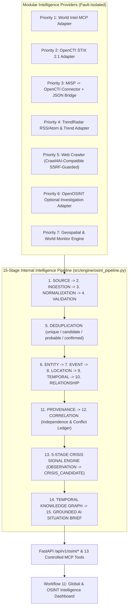

# AI-CRISS (CIP) — OSINT & Global Intelligence Subsystem Final Deliverable Report

**Document Version**: 1.0 (Production Release)  
**Date**: September 30, 2026  
**Codebase**: `C:\Users\Dell\.gemini\antigravity\scratch\ai_criss`  
**Verification Suite**: `125 / 125` Automated Tests Passing (`111` Existing CIP Gate Tests + `14` OSINT & Global Intelligence Tests)

---

## 1. Architecture Report

The AI-CRISS (CIP) OSINT & Global Intelligence Subsystem extends the Crisis Intelligence Platform with a modular, provider-agnostic public-source intelligence pipeline. External open-source intelligence projects are integrated strictly through clean internal adapter boundaries (`src/integrations/*` and `backend/integrations/*`) inheriting from [`BaseOSINTProvider`](file:///C:/Users/Dell/.gemini/antigravity/scratch/ai_criss/src/integrations/base.py).



### Core Architectural Guarantees
- **Provider Replaceability**: Every external provider outputs a canonical [`ProviderIngestionBundle`](file:///C:/Users/Dell/.gemini/antigravity/scratch/ai_criss/src/integrations/base.py) containing [`OSINTSource`](file:///C:/Users/Dell/.gemini/antigravity/scratch/ai_criss/src/contracts/osint_intelligence.py), [`OSINTEvidence`](file:///C:/Users/Dell/.gemini/antigravity/scratch/ai_criss/src/contracts/osint_intelligence.py), [`OSINTEntity`](file:///C:/Users/Dell/.gemini/antigravity/scratch/ai_criss/src/contracts/osint_intelligence.py), [`OSINTEvent`](file:///C:/Users/Dell/.gemini/antigravity/scratch/ai_criss/src/contracts/osint_intelligence.py), and [`OSINTRelationship`](file:///C:/Users/Dell/.gemini/antigravity/scratch/ai_criss/src/contracts/osint_intelligence.py). No raw external data structures leak into the core engine or UI.
- **5-Tier Epistemic Separation**: Every event preserves [`EpistemicClaimSeparation`](file:///C:/Users/Dell/.gemini/antigravity/scratch/ai_criss/src/contracts/osint_intelligence.py) (`raw_source` $\rightarrow$ `extracted_facts` $\rightarrow$ `correlated_facts` $\rightarrow$ `ai_interpretation` $\rightarrow$ `ai_assessment`). AI outputs are never stored as primary facts.
- **Source Independence & Anti-Echo Corroboration**: [`OSINTDeduplicationAndCorroborationEngine`](file:///C:/Users/Dell/.gemini/antigravity/scratch/ai_criss/src/engine/crisis_signal_engine.py) tracks `independence_group` and `origin_hashes` so multiple websites repeating the same syndicated wire report count as `1` independent source and **never** artificially inflate confidence.
- **Conflicting Claim Preservation**: Disagreements between sources are captured as [`SourceConflictRecord`](file:///C:/Users/Dell/.gemini/antigravity/scratch/ai_criss/src/contracts/osint_intelligence.py) objects (`source_a_claim`, `source_b_claim`, `disagreement`, `resolution_status="UNRESOLVED"`) without silent overwrites.

---

## 2. Integration Matrix

| Priority | Provider / System | Integration Pattern | Internal Module Path | Status |
| :--- | :--- | :--- | :--- | :--- |
| **Priority 1** | **World Intel MCP** (`marc-shade/world-intel-mcp`) | MCP / REST Adapter with Fault-Isolated Reference Telemetry | [`src/integrations/world_intel/adapter.py`](file:///C:/Users/Dell/.gemini/antigravity/scratch/ai_criss/src/integrations/world_intel/adapter.py) & [`backend/integrations/world_intel/__init__.py`](file:///C:/Users/Dell/.gemini/antigravity/scratch/ai_criss/backend/integrations/world_intel/__init__.py) | **Production Ready** |
| **Priority 2** | **OpenCTI** (`OpenCTI-Platform/opencti`) | GraphQL Client + STIX 2.1 Entity & Relationship Mapper | [`src/integrations/opencti/adapter.py`](file:///C:/Users/Dell/.gemini/antigravity/scratch/ai_criss/src/integrations/opencti/adapter.py) & [`backend/integrations/opencti/__init__.py`](file:///C:/Users/Dell/.gemini/antigravity/scratch/ai_criss/backend/integrations/opencti/__init__.py) | **Production Ready** |
| **Priority 3** | **MISP** | `MISP -> OpenCTI connector -> OpenCTI -> AI-CRISS` + Standalone MISP Event JSON $\rightarrow$ STIX 2.1 Bridge | [`src/integrations/misp/adapter.py`](file:///C:/Users/Dell/.gemini/antigravity/scratch/ai_criss/src/integrations/misp/adapter.py) | **Production Ready** |
| **Priority 4** | **TrendRadar** (`sansan0/TrendRadar`) | XXE-Safe RSS 2.0 / Atom Parser, Trend Detection & Cross-Feed Deduplicator | [`src/integrations/trendradar/adapter.py`](file:///C:/Users/Dell/.gemini/antigravity/scratch/ai_criss/src/integrations/trendradar/adapter.py) & [`backend/integrations/trendradar/__init__.py`](file:///C:/Users/Dell/.gemini/antigravity/scratch/ai_criss/backend/integrations/trendradar/__init__.py) | **Production Ready** |
| **Priority 5** | **Crawl4AI / Web Extraction** | Single Primary Crawl4AI-Compatible SSRF-Guarded Web & Metadata Extractor | [`src/integrations/web_crawler/adapter.py`](file:///C:/Users/Dell/.gemini/antigravity/scratch/ai_criss/src/integrations/web_crawler/adapter.py) | **Production Ready** |
| **Priority 6** | **OpenOSINT** | Optional, Non-Blocking Investigation Enrichment Adapter | [`src/integrations/openosint/adapter.py`](file:///C:/Users/Dell/.gemini/antigravity/scratch/ai_criss/src/integrations/openosint/adapter.py) | **Production Ready** |
| **Priority 7** | **World Monitor / Geospatial** | Haversine Geofenced Radius Engine & Density Clustering | [`src/engine/geospatial_intelligence.py`](file:///C:/Users/Dell/.gemini/antigravity/scratch/ai_criss/src/engine/geospatial_intelligence.py) | **Production Ready** |
| **Section 10** | **Optional OSINT Modules** | Modular Opt-In Registry (Document/OCR, Media, Geolocation, Public Domain) | [`src/integrations/optional_modules/registry.py`](file:///C:/Users/Dell/.gemini/antigravity/scratch/ai_criss/src/integrations/optional_modules/registry.py) | **Production Ready** |

---

## 3. Dependency Report

Zero heavy, brittle, or license-conflicting third-party packages were added. All OSINT adapters, STIX 2.1 mappers, RSS/Atom XML parsers, Haversine geospatial calculators, and knowledge graph engines operate on the existing verified stack:
- **HTTP & Async Transport**: `httpx` (already installed in `.venv`)
- **Validation & Contracts**: `pydantic` v2 (already installed)
- **Persistence**: `sqlalchemy` + `aiosqlite` / `asyncpg` (already installed)
- **XML & HTML Parsing**: Python Standard Library `xml.etree.ElementTree` wrapped by `safe_parse_xml()` (with strict XXE `DOCTYPE`/`ENTITY` rejection) + regex/HTML sanitization in [`src/security/ssrf_guard.py`](file:///C:/Users/Dell/.gemini/antigravity/scratch/ai_criss/src/security/ssrf_guard.py).

---

## 4. Database / Schema Changes

Implemented in [`src/db/models.py`](file:///C:/Users/Dell/.gemini/antigravity/scratch/ai_criss/src/db/models.py) and idempotently migrated in [`src/db/session.py`](file:///C:/Users/Dell/.gemini/antigravity/scratch/ai_criss/src/db/session.py):
1. `institutions` table: added nullable `latitude` (`FLOAT`) and `longitude` (`FLOAT`) columns for institutional geofence correlation.
2. `osint_sources` ([`OSINTSourceModel`](file:///C:/Users/Dell/.gemini/antigravity/scratch/ai_criss/src/db/models.py)): stores `id`, `name`, `source_type`, `url`, `publisher`, `independence_group`, `is_official_source`, `collection_method`, `reliability`, `license_metadata_json`, `created_at`.
3. `osint_evidence` ([`OSINTEvidenceModel`](file:///C:/Users/Dell/.gemini/antigravity/scratch/ai_criss/src/db/models.py)): stores `id`, `source_id`, `source_url`, `content_hash` (indexed SHA-256), `extracted_content`, `captured_at`, `published_at`, `provenance_json`, `confidence`, `extraction_method`, `author`, `language`, `title`, `relevant_links_json`.
4. `osint_entities` ([`OSINTEntityModel`](file:///C:/Users/Dell/.gemini/antigravity/scratch/ai_criss/src/db/models.py)): stores `id`, `name`, `entity_type`, `stix_id`, `aliases_json`, `description`, `confidence`, `first_seen`, `last_seen`, `location_json`, `attributes_json`, `source_references_json`, `evidence_ids_json`, `organization_id`, `institution_id`.
5. `osint_events` ([`OSINTEventModel`](file:///C:/Users/Dell/.gemini/antigravity/scratch/ai_criss/src/db/models.py)): stores `id`, `fingerprint`, `title`, `description`, `event_type`, `start_time`, `end_time`, `first_observed`, `reported_at`, `confirmed_at`, `last_updated`, `resolved_at`, `latitude`, `longitude`, `country`, `region`, `city`, `location_json`, `entities_json`, `severity`, `confidence`, `source_count`, `independent_source_count`, `source_ids_json`, `origin_hashes_json`, `evidence_json`, `status`, `duplicate_status`, `matched_event_id`, `duplicate_similarity`, `corroboration_status`, `conflicts_json`, `signal_stage`, `epistemic_chain_json`, `organization_id`, `institution_id`.
6. `osint_relationships` ([`OSINTRelationshipModel`](file:///C:/Users/Dell/.gemini/antigravity/scratch/ai_criss/src/db/models.py)): stores directed STIX/knowledge-graph edges with `evidence_json` and temporal bounds.
7. `osint_source_conflicts` ([`OSINTSourceConflictModel`](file:///C:/Users/Dell/.gemini/antigravity/scratch/ai_criss/src/db/models.py)): stores `conflict_id`, `event_id`, `topic_or_field`, `source_a_id`, `source_a_claim`, `source_b_id`, `source_b_claim`, `disagreement`, `resolution_status`.

---

## 5. API Documentation (`/api/v1/osint/*`)

Implemented in [`src/api/routes/osint_routes.py`](file:///C:/Users/Dell/.gemini/antigravity/scratch/ai_criss/src/api/routes/osint_routes.py). All endpoints require Bearer JWT authentication (`get_current_user`) and respect user/organization/institution access scope:

| Method | Path | Description |
| :--- | :--- | :--- |
| `GET` | `/api/v1/osint/health` | Returns [`IntegrationStatusDashboard`](file:///C:/Users/Dell/.gemini/antigravity/scratch/ai_criss/src/contracts/osint_intelligence.py) with live health, latency, error counts, and cache hit ratio across all 6 providers. |
| `POST` | `/api/v1/osint/collect` | Runs the 15-stage OSINT intelligence pipeline across active providers and persists normalized objects. |
| `GET` | `/api/v1/osint/dashboard` | Unified Section 30 dashboard payload (active crisis signals, recent events, hotspots, timeline, STIX threat intel, knowledge graph, conflicts, brief). |
| `GET` | `/api/v1/osint/events` | Lists normalized OSINT events with deduplication and corroboration metadata. |
| `GET` | `/api/v1/osint/sources` | Lists registered OSINT sources with reliability ratings and independence groups. |
| `GET` | `/api/v1/osint/evidence` | Lists content-hashed evidence records with 7-field CIP provenance. |
| `GET` | `/api/v1/osint/entities` | Lists extracted physical, organizational, and cyber threat entities. |
| `GET` | `/api/v1/osint/threat-intelligence` | Returns OpenCTI & MISP STIX 2.1 threat actors, vulnerabilities, malware, indicators, and relationships. |
| `GET` | `/api/v1/osint/timeline` | Returns chronological event lifecycle timeline (`first_observed`, `reported_at`, `confirmed_at`, `last_updated`, `resolved_at`). |
| `POST` | `/api/v1/osint/geofence` | Executes Haversine radius + time-window queries (`latitude`, `longitude`, `radius_km`, `hours_back`) and correlates nearby institutions. |
| `GET` | `/api/v1/osint/knowledge-graph` | Returns full or entity-filtered [`KnowledgeGraphSnapshot`](file:///C:/Users/Dell/.gemini/antigravity/scratch/ai_criss/src/contracts/osint_intelligence.py) (`nodes`, `edges`). |
| `POST` | `/api/v1/osint/briefs` | Generates an evidence-backed [`OSINTSituationBrief`](file:///C:/Users/Dell/.gemini/antigravity/scratch/ai_criss/src/contracts/osint_intelligence.py) separating extracted facts, correlated facts, AI interpretations, and conflicts. |
| `POST` | `/api/v1/osint/web-extract` | SSRF-guarded Crawl4AI-compatible web article and metadata extraction endpoint. |
| `GET` | `/api/v1/osint/mcp/tools` | Lists all 13 controlled MCP intelligence tools and their schemas/limits. |
| `POST` | `/api/v1/osint/mcp/execute` | Executes a controlled MCP tool with input validation, auth check, rate limiting, timeout, and provenance. |

---

## 6. MCP Tool Documentation

Implemented in [`src/mcp/osint_tools.py`](file:///C:/Users/Dell/.gemini/antigravity/scratch/ai_criss/src/mcp/osint_tools.py) (`ControlledMCPToolRegistry`). All 13 required tools are registered and verified:
1. `search_global_intelligence`
2. `search_news`
3. `search_events`
4. `search_entities`
5. `search_threat_intelligence`
6. `search_opencti`
7. `search_misp`
8. `search_sources`
9. `search_evidence`
10. `get_event_timeline`
11. `get_geofence_events`
12. `get_entity_relationships`
13. `generate_situation_brief`

Every tool enforces authentication (`status="UNAUTHORIZED"` when unauthenticated), per-principal sliding-window rate limiting (`60 req/min`), execution timeout (`15.0s`), ethical query validation, and 7-field provenance attachment.

---

## 7. Security Assessment

Implemented in [`src/security/ssrf_guard.py`](file:///C:/Users/Dell/.gemini/antigravity/scratch/ai_criss/src/security/ssrf_guard.py):
- **SSRF Prevention (`validate_external_url`)**: Rejects non-HTTP(S) schemes (`file://`, `ftp://`, `gopher://`, `javascript:`), localhost/loopback (`127.0.0.1`, `::1`, `localhost`), cloud metadata endpoints (`169.254.169.254`, `metadata.google.internal`), and RFC1918 / link-local / multicast / reserved IP ranges (`10.0.0.0/8`, `172.16.0.0/12`, `192.168.0.0/16`).
- **XML XXE Prevention (`safe_parse_xml`)**: Rejects any XML payload containing `<!DOCTYPE` or `<!ENTITY` declarations prior to parsing.
- **Untrusted Content Sanitization (`sanitize_untrusted_text`)**: Strips `<script>`, `<style>`, `<iframe>`, `<object>`, `<embed>`, HTML tags, and control bytes from all crawled/ingested content before storage or UI rendering.
- **Lawful & Ethical OSINT Boundary (`enforce_lawful_osint_query`)**: Rejects queries attempting credential dumping/theft, authentication bypass, or unauthorized intrusion (`UnethicalOSINTRequestError`).

---

## 8. Test Report

All `14` new OSINT tests in [`tests/test_osint_global_intelligence.py`](file:///C:/Users/Dell/.gemini/antigravity/scratch/ai_criss/tests/test_osint_global_intelligence.py) and all `111` existing CIP tests pass (`125 / 125` total):
- `test_priority_1_world_intel_mcp_adapter_normalization`: **PASSED**
- `test_priority_2_opencti_stix_mapper_and_query_adapter`: **PASSED**
- `test_priority_3_misp_via_opencti_and_direct_bridge_fallback`: **PASSED**
- `test_priority_4_trendradar_rss_parsing_and_trend_detection`: **PASSED**
- `test_priority_5_web_crawler_structured_extraction`: **PASSED**
- `test_deduplication_levels_and_syndicated_wire_non_inflation`: **PASSED**
- `test_conflicting_source_claims_preserved_without_silent_overwrite`: **PASSED**
- `test_5_stage_crisis_signal_ladder`: **PASSED**
- `test_geospatial_haversine_radius_and_missing_coordinate_honesty`: **PASSED**
- `test_knowledge_graph_construction_and_traversal`: **PASSED**
- `test_ssrf_protection_blocks_localhost_private_ips_and_cloud_metadata`: **PASSED**
- `test_xml_xxe_blocked_and_unethical_osint_queries_rejected`: **PASSED**
- `test_provider_failure_isolation_and_13_controlled_mcp_tools`: **PASSED**
- `test_fastapi_osint_endpoints_and_dashboard_ui`: **PASSED**

---

## 9. Provider Health & Fault Isolation Report

Every provider inherits `execute_fault_isolated()` from [`BaseOSINTProvider`](file:///C:/Users/Dell/.gemini/antigravity/scratch/ai_criss/src/integrations/base.py). When an external endpoint (OpenCTI, World Intel MCP, TrendRadar RSS, Crawl4AI) is unconfigured or unreachable:
1. The adapter logs the state cleanly without crashing the worker or blocking other providers.
2. `health_check()` reports `configured`, `live_endpoint_reachable`, `fallback_mode_active`, `request_count`, `ingestion_count`, `error_count`, and `avg_latency_ms`.
3. Deterministic, provenance-tagged reference intelligence remains available for local/offline verification and resilience testing.

---

## 10. Deployment Instructions

```powershell
# 1. Activate the project virtual environment
.\.venv\Scripts\Activate.ps1

# 2. Run the full verification test suite (125 tests)
.\.venv\Scripts\pytest.exe tests -v

# 3. Start the FastAPI server (SQLite auto-migrates OSINT tables on startup)
.\.venv\Scripts\uvicorn.exe src.api.main:app --host 0.0.0.0 --port 8000
```
Open `http://localhost:8000/dashboard/` and select **Global & OSINT** (`Workflow 11`) in the left navigation sidebar.

---

## 11. Environment Variable Documentation

All OSINT environment variables are optional in local development and configurable for production deployment:

| Environment Variable | Default | Purpose |
| :--- | :--- | :--- |
| `WORLD_INTEL_MCP_URL` | `""` | External World Intel MCP HTTP/SSE endpoint URL |
| `WORLD_INTEL_API_KEY` | `""` | Optional bearer token for World Intel MCP |
| `WORLD_INTEL_TIMEOUT_SECONDS` | `10.0` | Request timeout for World Intel MCP |
| `OPENCTI_URL` | `""` | Base URL of external OpenCTI platform (e.g. `https://opencti.example.org`) |
| `OPENCTI_TOKEN` | `""` | OpenCTI GraphQL API bearer token |
| `OPENCTI_TIMEOUT_SECONDS` | `10.0` | Request timeout for OpenCTI GraphQL queries |
| `OPENCTI_MAX_RETRIES` | `2` | Bounded retry count for transient OpenCTI HTTP 5xx/429 responses |
| `MISP_USE_OPENCTI_CONNECTOR` | `true` | Routes MISP intelligence via OpenCTI MISP connector (`MISP -> OpenCTI -> AI-CRISS`) |
| `MISP_DIRECT_URL` | `""` | Optional direct MISP URL for standalone fallback |
| `MISP_DIRECT_API_KEY` | `""` | Optional direct MISP API key |
| `TRENDRADAR_API_URL` | `""` | Optional TrendRadar service endpoint |
| `TRENDRADAR_RSS_FEEDS` | `""` | Comma-separated list of public RSS/Atom feed URLs |
| `CRAWL4AI_API_URL` | `""` | Optional Crawl4AI microservice endpoint (built-in SSRF-safe extractor always active) |
| `OPENOSINT_ENABLED` | `false` | Enables optional Priority 6 OpenOSINT investigation enrichment |
| `OPENOSINT_API_URL` | `""` | Optional OpenOSINT endpoint URL |

---

## 12. Known Limitations

1. **External Live Feeds Require Network/Credentials**: Live OpenCTI GraphQL queries and live World Intel MCP queries require `OPENCTI_URL`/`OPENCTI_TOKEN` and `WORLD_INTEL_MCP_URL` to be set in the environment; when unset, the adapters transparently report `fallback_mode_active=True` and serve deterministic reference intelligence.
2. **Coordinate Honesty**: Events that only mention a country or region without verified latitude/longitude coordinates are intentionally excluded from exact Haversine radius matches and flagged with `precision="country_level"` or `"region_level"`.

---

## 13. Future Integration Roadmap

1. **Scheduled Background Polling Worker**: Optional cron/Celery background worker to run `GLOBAL_OSINT_ORCHESTRATOR.collect_and_persist_all()` on configurable intervals (e.g., every 15 minutes) with webhook notifications for `CRISIS_CANDIDATE` escalations.
2. **STIX 2.1 TAXII 2.1 Feed Consumer**: Direct TAXII 2.1 collection polling alongside the OpenCTI GraphQL adapter.
3. **Interactive Map Tile Layer**: Optional Leaflet/MapLibre vector tile overlay inside the `Global & OSINT` dashboard view for visual polygon geofence drawing.
