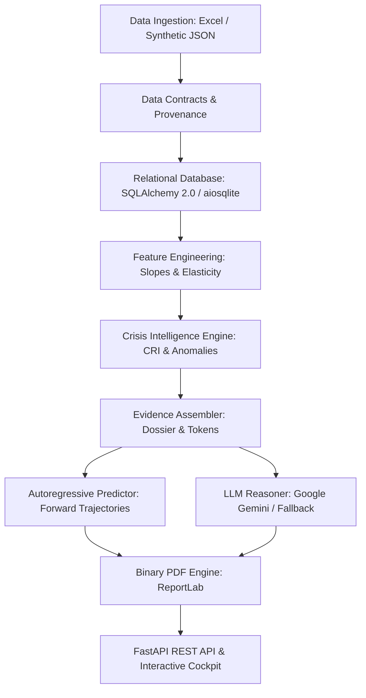

# AI CRISS — Institutional Crisis Intelligence Platform

**AI CRISS** (Cross-Signal Institutional Risk and Early Warning System) is an audit-grade intelligence platform engineered to detect, quantify, project, and explain structural crises across higher-education institutions before institutional failure occurs.

---

## Key Capabilities

1. **Multi-Signal Anomaly Detection & Cross-Signal Correlation**
   - Ingests Admissions (intake, vacancy, enrolled), Campus Placements (placed %, median package, core engineering placements), and CET Cutoff/Rankings.
   - Detects multi-year statistical drift using rolling Z-scores and longitudinal thresholding.

2. **Deterministic Composite Risk Index (CRI)**
   - Computes an empirical, immutable risk index bounded strictly to `[0.000, 1.000]`.
   - Classification tiers: `NOMINAL` (`< 0.30`), `ELEVATED` (`0.30 - 0.50`), `HIGH` (`0.50 - 0.75`), and `CRITICAL` (`> 0.75`).
   - Strict invariant guarantee: Mathematical risk metrics and anomaly flags are computed deterministically. The AI reasoning engine never calculates or tampers with numerical scores.

3. **Autoregressive Trajectory Forecasting & Policy Simulator**
   - Projects 1 to 5 years forward under status-quo momentum.
   - Simulates policy interventions (e.g. corporate placement boost, seat matrix rationalization) with 95% confidence intervals.

4. **Cryptographic & Traceable Evidence Dossiers**
   - Compiles atomic, mathematically-grounded `EvidenceToken` instances linking observed values, baselines, and Z-scores to physical dataset provenance.

5. **Live Google Gemini API Integration with Deterministic Offline Fallback**
   - Powered by official Google Gen AI SDK (`google-genai`).
   - Uses strict Pydantic structured output schemas (`ExecutiveNarrativeResponse`) at temperature `0.0`.
   - Guaranteed deterministic fallback when API key is missing or on network failure.

6. **Audit-Grade Binary PDF Report Generation**
   - Generates deterministic binary `.pdf` executive crisis reports via ReportLab Platypus.
   - Endpoints provide instant download at `/api/v1/institutions/{id}/report/pdf`.

7. **Interactive Dashboard Cockpit & Complete Next.js Suite**
   - Embedded FastAPI dashboard served at `/dashboard/` with real-time Chart.js dials, trajectory curves, and PDF export.
   - Full Next.js 14 App Router application in `src/frontend/` with TypeScript and Tailwind CSS.

---

## System Architecture



---

## Installation & Setup

### 1. Prerequisites
- Python 3.11+ (Python 3.13 tested and verified)
- Node.js 18+ (optional, for Next.js frontend builds)

### 2. Environment Setup
```bash
# Clone and enter directory
cd ai_criss

# Activate existing virtual environment (or create one)
.\.venv\Scripts\activate

# Install dependencies
pip install -r requirements.txt
```

### 3. Environment Variables
Copy `.env.example` to `.env`:
```bash
cp .env.example .env
```
Key configuration items:
- `DATABASE_URL`: `sqlite+aiosqlite:///./ai_criss.db`
- `JWT_SECRET_KEY`: Your secret key for signing tokens
- `GEMINI_API_KEY`: Google Gemini API key (optional; system operates autonomously via deterministic fallback if absent)

---

## Running the Application

### 1. Launch the Backend & Interactive Cockpit
```bash
python -m uvicorn src.api.main:app --host 0.0.0.0 --port 8000 --reload
```
Access the application:
- **Interactive Cockpit**: [http://127.0.0.1:8000/dashboard/](http://127.0.0.1:8000/dashboard/)
- **Swagger API Docs**: [http://127.0.0.1:8000/docs](http://127.0.0.1:8000/docs)
- **Health Check**: [http://127.0.0.1:8000/health](http://127.0.0.1:8000/health)

### 2. Running Automated Tests
The system includes 52 automated tests with 100% pass rate:
```bash
pytest -v
```

---

## REST API Overview

| Method | Endpoint | Description | Auth Required |
|---|---|---|---|
| `GET` | `/health` | System health check & layer verification | No |
| `GET` | `/dashboard/` | Interactive Single-Page Cockpit UI | No |
| `POST` | `/api/v1/auth/register` | Register a new user | No |
| `POST` | `/api/v1/auth/login` | Authenticate and obtain JWT Bearer token | No |
| `GET` | `/api/v1/auth/me` | Retrieve authenticated user profile & role | Yes |
| `POST` | `/api/v1/ingest/synthetic` | Ingest synthetic crisis scenario | Yes |
| `GET` | `/api/v1/institutions` | List all monitored institutions | Yes |
| `GET` | `/api/v1/institutions/{id}/evaluate` | Execute full mathematical crisis scoring | Yes |
| `GET` | `/api/v1/institutions/{id}/dossier` | Retrieve structured evidence dossier | Yes |
| `POST` | `/api/v1/institutions/{id}/simulate` | Run multi-year autoregressive simulation | Yes |
| `GET` | `/api/v1/institutions/{id}/report` | Generate LLM executive narrative | Yes |
| `GET` | `/api/v1/institutions/{id}/report/pdf` | Export audit-grade binary PDF report | Yes |

---

## Verified Evaluation Results

- **Automated Test Suite**: 52 tests passing (100%) across 12 test modules.
- **Real Institution (RYMEC)**:
  - Time Horizon: 2021–2024 (4 Academic Years)
  - Evaluated Signals: 32 Admissions, 32 Placements, 32 CET Cutoffs
  - Measured Composite Risk Index (CRI): **0.573** (Classification: **HIGH RISK**)
  - Primary Risk Driver: Placement percentage collapse in legacy departments
  - Autoregressive 3-Year Projection: Status-quo reaches 0.720 CRI; simulated intervention reduces CRI by 0.145.
